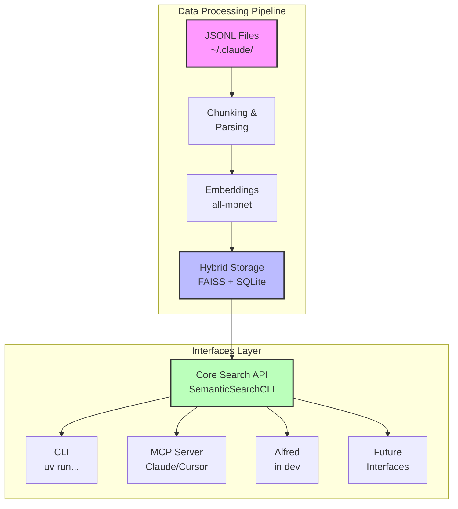

# Claude Semantic Search

A powerful semantic search system for Claude conversations that enables fast, intelligent retrieval through natural language queries. Access your Claude Code sessions from anywhere - Claude Code itself, CLI, Claude Desktop, Cursor IDE, and Alfred (in development)!


## Why This Project?

Ever wished you could instantly find that Claude Code conversation where you solved a tricky bug or implemented a complex feature? This project was born from the need to easily retrieve Claude Code sessions from anywhere - whether you're in Claude Code itself, working in your terminal, using Claude Desktop, coding in Cursor IDE, or even through Alfred on macOS.

Your Claude conversations contain valuable knowledge - code solutions, architectural decisions, debugging sessions, and implementation details. This tool makes that knowledge instantly searchable and accessible across all your development workflows.

<figure style="text-align: center;">
  

</figure>
<figure style="text-align: center;">
  

</figure>

## Features

### Multi-Platform Access
- **Claude Code**: Search directly within Claude Code using MCP tools
- **CLI**: Powerful command-line tools for indexing and searching
- **Claude Desktop**: Native integration via MCP server
- **Cursor IDE**: Full MCP tool support for searching within your editor
- **Alfred**: JSON output for workflow integration (in development)

### Core Features
- **Semantic Search**: Uses all-mpnet-base-v2 embeddings for high-quality semantic matching
- **Hybrid Storage**: Combines FAISS vector search with SQLite metadata storage
- **Smart Chunking**: Context-aware chunking optimized for code discussions and Q&A pairs
- **Incremental Indexing**: Only processes new/modified files after initial index
- **GPU Acceleration**: Optional CUDA/MPS support for 5-10x performance improvements
- **Auto-Indexing Daemon**: Background service that automatically indexes new conversations

### Advanced Filtering
- Date ranges (before/after)
- Project filtering with partial matching (case-insensitive)
- Code content filtering
- Session-based search
- Related chunk discovery
- Direct chunk access by ID

## Installation

### Prerequisites

- Python 3.11+
- UV package manager (recommended)

### Setup

#### Option 1: Automated Installation (Recommended)

1. **Clone and run the install script:**
```bash
git clone https://github.com/pauloportella/claude-semantic-search
cd claude-semantic-search
./install.sh
```

This will:
- Install the MCP server and CLI tools globally
- Configure Claude Code to use the semantic search MCP server
- Download the embedding model (~420MB)
- Make all commands available system-wide

#### Option 2: Manual Installation

1. **Clone and setup the project:**
```bash
git clone https://github.com/pauloportella/claude-semantic-search
cd claude-semantic-search
uv sync
```

2. **Install as a global tool (for use outside the project directory):**
```bash
uv tool install .
```

3. **Configure Claude Code** by adding to `~/.claude.json`:
```json
{
  "mcpServers": {
    "claude-semantic-search": {
      "command": "claude-search-mcp",
      "args": []
    }
  }
}
```

4. **Download the embedding model:**
```bash
setup-models  # If installed globally
# OR
uv run setup-models  # If using local installation
```

This downloads the all-mpnet-base-v2 model (~420MB) for high-quality embeddings.

### GPU Support (Optional)

For 5-10x faster performance, install GPU support:

```bash
# NVIDIA CUDA systems
conda install pytorch torchvision torchaudio pytorch-cuda=12.1 -c pytorch -c nvidia
conda install faiss-gpu -c conda-forge

# Apple Silicon (M1/M2/M3/M4) - PyTorch MPS support is already included
# No additional installation needed!
```

## Quick Start

### 1. Index Your Conversations
```bash
claude-index  # If installed globally
# OR
uv run claude-index  # If using local installation
```

### 2. Search from Terminal
```bash
claude-search "your search query"  # If installed globally
# OR
uv run claude-search "your search query"  # If using local installation
```

### 3. Enable in Claude Code, Claude Desktop, and Cursor
If you used the automated installation, all supported applications are already configured:
- ✅ Claude Code
- ✅ Claude Desktop (macOS)
- ✅ Cursor IDE

The install script automatically configures the MCP server for all detected applications.

If you need to manually configure later, add this to the respective config files:

**Claude Code** (`~/.claude.json`) and **Cursor** (`~/.cursor/mcp.json`):
```json
{
  "mcpServers": {
    "claude-semantic-search": {
      "command": "claude-search-mcp",
      "args": []
    }
  }
}
```

**Claude Desktop** (`~/Library/Application Support/Claude/claude_desktop_config.json`):
```json
{
  "mcpServers": {
    "claude-semantic-search": {
      "command": "$HOME/.local/bin/claude-search-mcp",
      "args": []
    }
  }
}
```
Note: Claude Desktop requires the full path since it doesn't have `~/.local/bin` in its PATH.

Restart the applications and search naturally:
- "Search for my GPU performance discussions"
- "Find conversations about the daisy project with code"

## Usage

### Basic Commands

#### 1. Index Your Conversations

```bash
# Index all Claude conversations (incremental - only new/modified files)
claude-index

# Index from a specific directory
claude-index --claude-dir /path/to/conversations

# Force reindexing of all files (clears existing data)
claude-index --force

# Use GPU acceleration (5-10x faster)
claude-index --gpu
```

**Incremental Indexing**: By default, `claude-index` only processes files that have been added or modified since the last indexing. This makes subsequent runs much faster. Use `--force` to clear all data and reindex everything from scratch.

#### 2. Search Conversations

```bash
# Basic search
claude-search "rust programming"

# Search with filters (project names support partial matching)
claude-search "error handling" --project "my-project" --has-code
claude-search "persistence" --project "daisy-hft"  # Matches any project containing "daisy-hft"

# Limit results
claude-search "debugging" --top-k 5

# JSON output (for Alfred integration)
claude-search "python testing" --json

# Use GPU acceleration for faster search
claude-search "machine learning" --gpu
```

#### 3. View Statistics

```bash
# Show index statistics
claude-stats
```

#### 4. Watch for Changes (Daemon Mode)

```bash
# Start watcher daemon (uses incremental indexing)
claude-start

# Start with custom settings
claude-start --claude-dir /path/to/conversations --debounce 10

# Check daemon status
claude-status

# Stop daemon
claude-stop

# Interactive watch mode (foreground)
claude-watch

# Run watch as daemon (background)
claude-watch --daemon
```

**Auto-indexing**: The daemon watches for new or modified files and automatically indexes them using incremental indexing. When a file changes, only that file and other files in the same directory are checked for updates.

> **Note**: The commands above assume you used the recommended installation method (`./install.sh` or `uv tool install .`). If you're running from the source directory without global installation, prefix commands with `uv run` (e.g., `uv run claude-search "query"`).

### Advanced Usage

#### Search Filters

- `--project <name>`: Filter by project name
- `--has-code`: Only show chunks containing code
- `--top-k <n>`: Limit number of results (default: 10)
- `--after <date>`: Filter for chunks after date (YYYY-MM-DD)
- `--before <date>`: Filter for chunks before date (YYYY-MM-DD)
- `--session <id>`: Filter by session ID
- `--related-to <chunk-id>`: Find chunks related to given chunk ID
- `--same-session`: Include chunks from same session (use with --related-to)
- `--full-content`: Show full content instead of truncated
- `--chunk-id <id>`: Get specific chunk by ID

#### Examples

```bash
# Find Rust-related conversations with code
claude-search "rust async" --has-code

# Search in specific project
claude-search "database migration" --project "my-app"

# Get top 20 results about testing
claude-search "unit testing" --top-k 20

# Filter by date range
claude-search "kubernetes deployment" --after 2024-01-01 --before 2024-12-31

# Get specific chunk with full content
claude-search --chunk-id "chunk_abc123" --full-content

# Find related chunks in same session
claude-search --related-to "chunk_abc123" --same-session

# Search within specific session
claude-search "error handling" --session "session_xyz789"
```

## GPU Acceleration

Enable GPU support for 5-10x performance improvements:

### Installation

#### For NVIDIA CUDA Systems
```bash
# Install GPU dependencies (requires conda)
conda install pytorch torchvision torchaudio pytorch-cuda=12.1 -c pytorch -c nvidia
conda install faiss-gpu -c conda-forge

# Verify GPU availability
python -c "import torch; print(f'CUDA available: {torch.cuda.is_available()}')"
python -c "import faiss; print(f'FAISS GPU count: {faiss.get_num_gpus()}')"
```

#### For Apple Silicon (M1/M2/M3/M4)
```bash
# PyTorch with MPS support (already included in base installation)
# No additional installation needed! 

# Verify MPS availability
python -c "import torch; print(f'MPS available: {torch.backends.mps.is_available()}')"
claude-stats --gpu
```

### Requirements

#### NVIDIA CUDA (Full GPU acceleration)
- **NVIDIA GPU** with CUDA compute capability ≥ 3.5
- **CUDA toolkit** 11.4+ or 12.1+
- **GPU memory** ≥ 2GB recommended (varies by dataset size)

#### Apple Silicon MPS (Embedding acceleration only)
- **Apple M1, M2, M3, or M4** processors
- **macOS 12.3+** with native Python (arm64)
- **Unified memory** ≥ 8GB recommended

### Usage

```bash
# GPU-accelerated indexing (10-100x faster embedding generation)
claude-index --gpu

# GPU-accelerated search (5-10x faster vector search)
claude-search "your query" --gpu

# View GPU status and memory usage
claude-stats --gpu

# Start GPU-enabled daemon
claude-start --gpu
```

### Performance Benefits

| Operation | CPU Time | NVIDIA CUDA | Apple Silicon MPS | 
|-----------|----------|-------------|-------------------|
| Index 1k conversations | ~5 minutes | ~30 seconds (**10x**) | ~2 minutes (**2.5x**) |
| Index 10k conversations | ~50 minutes | ~5 minutes (**10x**) | ~20 minutes (**2.5x**) |
| Search queries | ~200ms | ~20ms (**10x**) | ~200ms (**1x** - CPU) |
| Embedding generation | ~100 texts/sec | ~1000 texts/sec (**10x**) | ~300 texts/sec (**3x**) |

**Note**: Apple Silicon provides 3-5x speedup for embedding generation but search remains on CPU since FAISS GPU doesn't support Metal Performance Shaders.

### Memory Requirements

The system automatically detects available GPU memory and optimizes batch sizes:

- **Small datasets** (< 1k chunks): ~1GB GPU memory
- **Medium datasets** (1k-10k chunks): ~2-4GB GPU memory  
- **Large datasets** (> 10k chunks): ~4-8GB GPU memory

### Troubleshooting

```bash
# Check GPU status
nvidia-smi

# Test PyTorch CUDA
python -c "import torch; print(torch.cuda.get_device_name(0))"

# Test FAISS GPU
python -c "import faiss; print(f'GPU count: {faiss.get_num_gpus()}')"

# Check installation
claude-stats --gpu
```

If GPU support fails, the system automatically falls back to CPU with a warning message.

## Architecture



### Components

1. **Data Processing Pipeline**:
   - **Parser**: Extracts structured data from Claude conversation JSONL files
   - **Chunker**: Creates semantic chunks using smart strategies (Q&A pairs, code blocks, context segments)
   - **Embeddings**: Generates 768-dimensional vectors using all-mpnet-base-v2
   - **Storage**: Hybrid FAISS + SQLite for fast semantic and metadata search

2. **Core Search API**: Shared search logic used by all interfaces

3. **Interface Layer**:
   - **CLI**: Command-line tools for direct terminal use
   - **MCP Server**: Enables integration with Claude Desktop and Cursor IDE
   - **Alfred**: macOS workflow integration (in development)
   - **Future**: Extensible for REST API, gRPC, etc.

## Performance

- **Model**: all-mpnet-base-v2 (420MB, 768 dimensions)
- **Accuracy**: 87-88% semantic similarity
- **Search Speed**: <500ms for typical queries
- **Memory**: <2GB during indexing
- **Storage**: ~1GB for 1000 conversations

## Alfred Integration

A complete Alfred workflow is included for macOS users.

### Quick Install

```bash
cd alfred-workflow
make install
```

This will build and install the workflow. Then configure your paths in Alfred Preferences → Workflows → Claude Semantic Search → [⚙️]

### Features

- `ccs <query>` - Search all conversations
- `ccp` - Browse projects (coming soon)
- `ccr <query>` - Recent conversations (coming soon)
- `ccc <query>` - Code chunks only (coming soon)

### Keyboard Modifiers

- `⌃` + Return - Resume session in tmux with `claude -r`
- `⌘` + Return - Copy chunk text to clipboard
- `⌥` + Return - View in large type

### JSON Output

The CLI provides JSON output for custom Alfred workflows:

```bash
claude-search "your query" --json
```

## MCP Server Integration

The MCP (Model Context Protocol) server enables native integration with Claude Code, Claude Desktop, and Cursor IDE, allowing you to search your conversation history directly within your AI tools.

### Automatic Setup

The install script (`./install.sh`) automatically configures the MCP server for all supported applications:
- Claude Code (`~/.claude.json`)
- Claude Desktop (`~/Library/Application Support/Claude/claude_desktop_config.json`)
- Cursor IDE (`~/.cursor/mcp.json`)

No manual configuration needed! Just run the install script and restart your applications.

### Manual Configuration

If you need to manually add the MCP server to any application, add this configuration:

```json
{
  "mcpServers": {
    "claude-semantic-search": {
      "command": "claude-search-mcp",
      "args": []
    }
  }
}
```

This works because the install script installs `claude-search-mcp` as a global command.

### Available MCP Tools

- `semantic_search`: Full-featured search with all filtering options
- `get_chunk_by_id`: Retrieve specific chunks
- `list_projects`: List all indexed projects
- `get_stats`: View index statistics
- `get_status`: Check daemon status

### Example Usage

In Claude Code, Claude Desktop, or Cursor, simply ask:
- "Search for my GPU performance discussions"
- "Find conversations about daisy project with code"
- "Show me all indexed projects"
- "Get chunk chunk_12345"

### Troubleshooting

If the MCP server isn't working:
1. Ensure you ran `./install.sh` and it completed successfully
2. Check that `which claude-search-mcp` returns a path
3. Restart the application (Claude Code/Desktop/Cursor)
4. Verify the configuration file exists and contains the MCP server entry

## Development

### Project Structure

```
semantic-search/
├── src/
│   ├── parser.py       # JSONL conversation parser
│   ├── chunker.py      # Smart chunking strategies
│   ├── embeddings.py   # Embedding generation
│   ├── storage.py      # Hybrid FAISS + SQLite storage
│   ├── cli.py          # Command-line interface
│   ├── mcp_server.py   # MCP server for Claude/Cursor integration
│   ├── watcher.py      # File system watcher for auto-indexing
│   └── gpu_utils.py    # GPU detection and configuration
├── tests/              # Comprehensive test suite
├── scripts/            # Utility scripts
└── data/               # Models and index storage
```

### Running Tests

```bash
# Run all tests
uv run pytest

# Run with coverage
uv run pytest --cov=src

# Run specific test file
uv run pytest tests/test_parser.py
```

### Code Quality

```bash
# Format code
uv run black src/ tests/

# Sort imports
uv run isort src/ tests/

# Type checking
uv run mypy src/

# Linting
uv run flake8 src/
```

## Configuration

### Command-Line Options

- `--claude-dir`: Specify Claude projects directory (default: `~/.claude/projects`)
- `--data-dir`: Specify data directory for indexes and models (default: `~/.claude-semantic-search/data`, env: `CLAUDE_SEARCH_DATA_DIR`)
- `--force`: Force reindexing (clears existing data)
- `--gpu`: Enable GPU acceleration

### Data Directory

By default, all data (indexes, models, and metadata) is stored in `~/.claude-semantic-search/data`. This ensures:
- Consistent location across all tools (CLI, MCP server, daemon)
- No permission issues with system directories
- Easy backup and migration

You can customize the data directory:
- **Environment variable**: `export CLAUDE_SEARCH_DATA_DIR=/your/custom/path`
- **Command line**: `--data-dir /your/custom/path`
- **Installation**: The install script prompts you to choose a custom location

### Storage Configuration

The system uses:
- **FAISS**: IndexFlatIP for exact cosine similarity search
- **SQLite**: Metadata storage with optimized indexes
- **Auto-save**: Indexes are automatically saved after updates

## Troubleshooting

### Common Issues

1. **Model Download Fails**
   ```bash
   # Re-download model
   uv run setup-models
   ```

2. **Empty Search Results**
   ```bash
   # Check if index exists
   claude-stats
   
   # Rebuild index
   claude-index --force
   ```

3. **Permission Errors**
   ```bash
   # Check Claude directory permissions
   ls -la ~/.claude/projects
   ```

4. **Memory Issues**
   ```bash
   # Reduce batch size in embeddings.py
   # Use smaller embedding model
   ```

### Performance Optimization

- **Incremental Indexing**: Only new/modified files are reprocessed
  - First indexing: Processes all files
  - Subsequent runs: Only processes changed files (typically 90%+ faster)
  - File modification tracking via SQLite metadata
- **Batch Processing**: Embeddings generated in optimized batches
- **Memory Mapping**: Large indexes use memory-mapped files
- **Compression**: Efficient storage formats reduce disk usage

## Contributing

1. Fork the repository
2. Create a feature branch
3. Add tests for new functionality
4. Ensure all tests pass
5. Submit a pull request

## License

This project is licensed under the MIT License - see the LICENSE file for details.

## Acknowledgments

- [sentence-transformers](https://github.com/UKPLab/sentence-transformers) for embedding models
- [FAISS](https://github.com/facebookresearch/faiss) for efficient similarity search
- [Click](https://github.com/pallets/click) for CLI framework
