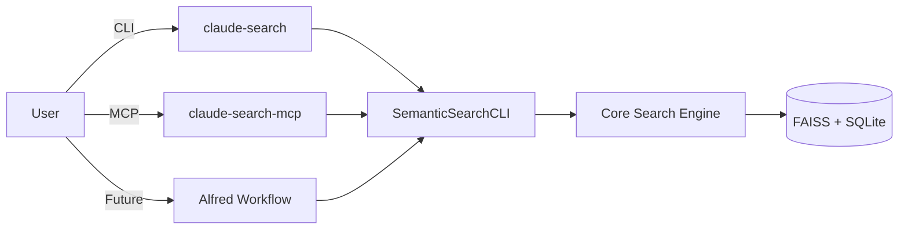

# MCP Integration - Visual Structure

## Minimal Changes Approach 🎯

```
semantic-search/
│
├── src/                      
│   ├── cli.py               ← Existing CLI interface
│   ├── mcp_server.py        ← 🆕 New MCP interface
│   └── ... (other modules)     (shares same core code)
│
├── tests/
│   ├── test_cli.py          ← Existing CLI tests  
│   ├── test_mcp_server.py   ← 🆕 New MCP tests
│   └── ... (other tests)
│
├── configs/                 ← 🆕 New directory
│   ├── claude_desktop_config.example.json
│   └── mcp_manifest.json
│
└── pyproject.toml           ← Updated with:
                               - New script: claude-search-mcp
                               - New optional dep: mcp>=1.10.1
```

## Integration Points



## File Summary

| File | Purpose | Lines of Code |
|------|---------|---------------|
| `src/mcp_server.py` | MCP server implementation | ~300 |
| `tests/test_mcp_server.py` | MCP tests | ~150 |
| `configs/claude_desktop_config.example.json` | User config template | ~10 |
| `configs/mcp_manifest.json` | MCP metadata | ~30 |

## Key Benefits

1. **Clean Separation**: Each interface (CLI, MCP, Alfred) is independent
2. **Code Reuse**: All interfaces use the same `SemanticSearchCLI` core
3. **Easy Testing**: Test structure mirrors source structure
4. **Simple Setup**: Just copy example config and edit path
5. **Future-Proof**: Easy to add more interfaces later

## User Workflow

```bash
# 1. Install MCP support
uv sync --extra mcp

# 2. Copy and edit config
cp configs/claude_desktop_config.example.json \
   ~/Library/Application\ Support/Claude/claude_desktop_config.json

# 3. Edit the path in the config file

# 4. Restart Claude Desktop

# 5. Use natural language:
"Search for GPU performance discussions"
"Show me all projects with code"
"Get the status of my search index"
```